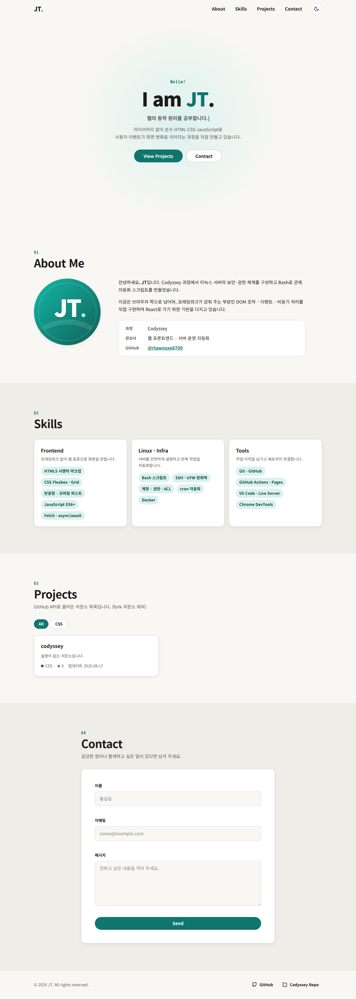
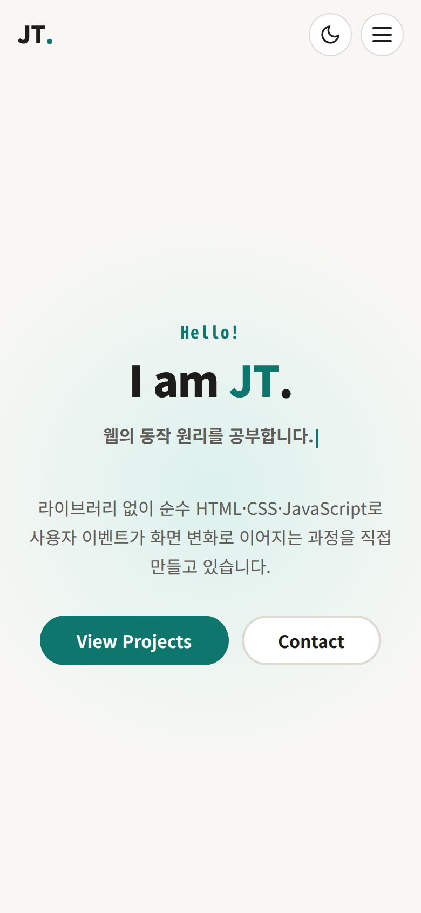
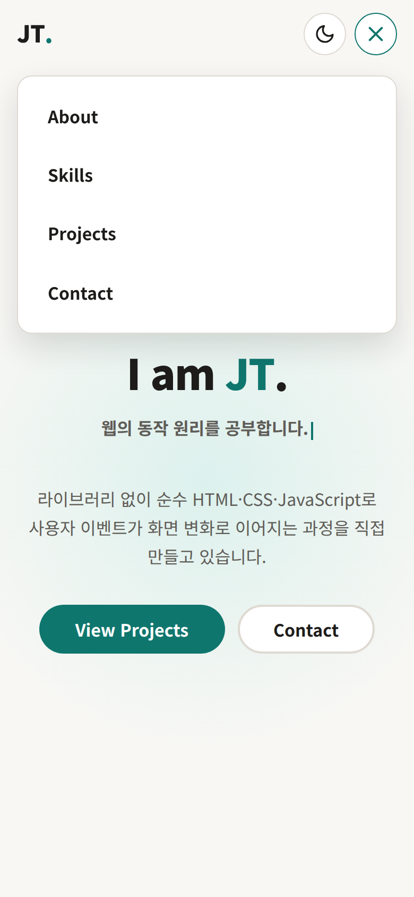
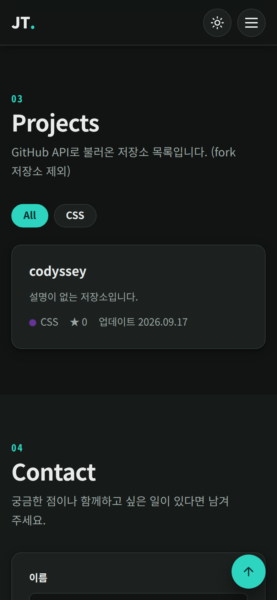
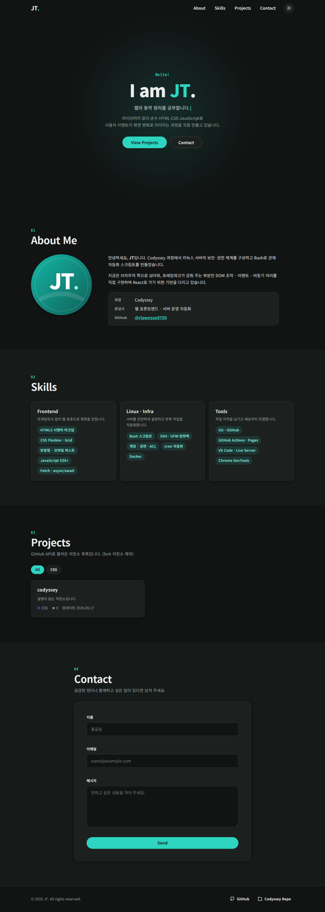
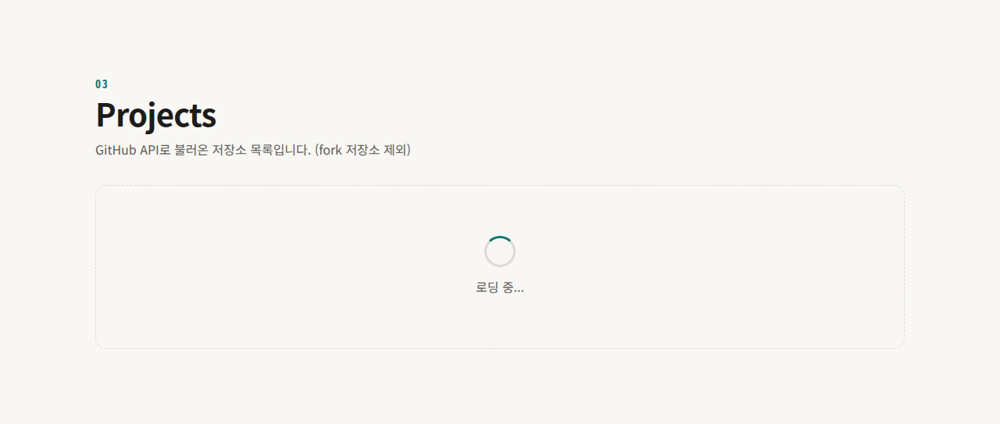
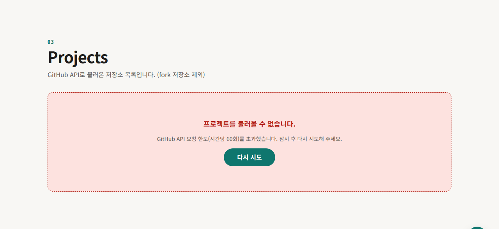
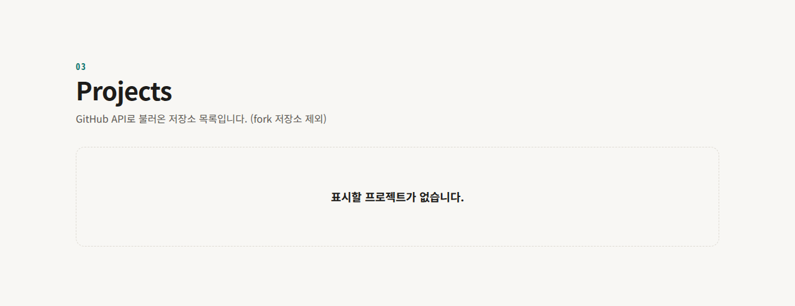
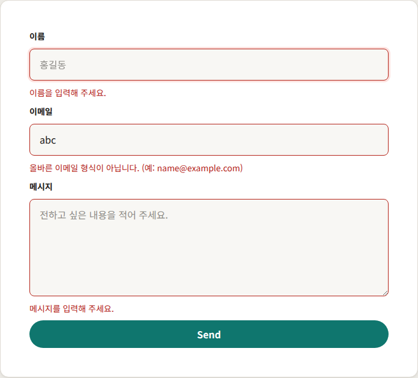

# JT 포트폴리오 — 반응형 포트폴리오 웹사이트 (b1-1)

> 외부 라이브러리 없이 **순수 HTML · CSS · JavaScript**로 만든 반응형 포트폴리오.
> "사용자 이벤트 → 상태 변경 → 화면 업데이트" 흐름을 모든 인터랙션에 같은 방식으로 적용했다.

| | |
|---|---|
| **배포 URL** | **https://rlawnsxo8709.github.io/codyssey/** |
| 저장소 | https://github.com/rlawnsxo8709/codyssey (`mission/b1-1/answers/`) |
| GitHub API | `https://api.github.com/users/rlawnsxo8709/repos` |

설계 결정과 검증 계획은 [PLAN.md](PLAN.md)에 있다.

---

## 목차

1. [스크린샷](#스크린샷)
2. [프로젝트 설명](#프로젝트-설명)
3. [사용 기술](#사용-기술)
4. [기능과 기준값](#기능과-기준값)
5. [폴더 구조](#폴더-구조)
6. [실행 방법](#실행-방법)
7. [상태 관리 흐름](#상태-관리-흐름)
8. [요구사항 체크리스트](#요구사항-체크리스트)
9. [검증](#검증)

---

## 스크린샷

> 데스크톱 · 모바일 · 다크 모드 화면은 **배포 URL에서 실제 GitHub API 응답으로** 촬영했다. (2026-09-17, Chromium)

### 데스크톱 (라이트)



### 모바일

| 첫 화면 | 햄버거 메뉴 열림 | 다크 모드 · Projects |
|---|---|---|
|  |  |  |

### 다크 모드 (데스크톱)



### 상태별 UI

API 응답을 가로채 각 상태를 재현한 화면이다.

| 로딩 | 에러 (403 요청 한도 초과) |
|---|---|
|  |  |

| 빈 상태 | 폼 유효성 검사 |
|---|---|
|  |  |

---

## 프로젝트 설명

React 학습 전에, 프레임워크가 감춰 주는 **DOM 조작 · 이벤트 · 비동기 처리**를 직접 구현한 1페이지 포트폴리오다.

- **섹션**: Hero(인사말 · CTA) / About(자기소개 · 프로필 이미지) / Skills(기술 스택) / Projects(GitHub API) / Contact(문의 폼) / Footer(저작권 · 소셜 링크)
- **상태 관리**: 화면에 영향을 주는 값은 모두 `state` 객체 하나에 모으고, `setState(key, value)`만이 상태를 바꾸며 해당 화면을 다시 그린다.
- **외부 API**: GitHub 저장소 목록을 불러와 카드로 렌더링하고, 로딩 · 성공 · 에러 · 빈 상태를 구분해 보여준다.
- **디자인 목표**: 화려함보다 흐름의 명확성. 색 · 간격 · 폰트는 CSS 변수 체계로 관리하고, 다크 모드는 변수 값 교체만으로 구현했다.

---

## 사용 기술

| 분류 | 내용 |
|---|---|
| 마크업 | HTML5 시맨틱 태그 (`header` `nav` `main` `section` `article` `footer`), ARIA 속성 |
| 스타일 | CSS3 — 변수(`:root`, `[data-theme="dark"]`), Flexbox, Grid(`auto-fit` + `minmax`), 모바일 퍼스트 미디어 쿼리, transition · keyframes |
| 스크립트 | JavaScript ES6+ — `const`/`let`, 화살표 함수, 템플릿 리터럴, 구조분해 할당, 스프레드, `map`/`filter`/`forEach`, `fetch` + `async`/`await`, `try`/`catch` |
| 브라우저 API | `addEventListener`, `querySelector(All)`, `classList`, `localStorage`, `IntersectionObserver`, `matchMedia`(`prefers-color-scheme`, `prefers-reduced-motion`), `FormData` |
| 외부 라이브러리 | **없음** (웹 폰트 대신 시스템 폰트, 아이콘은 인라인 SVG) |
| 개발 환경 | VS Code + Live Server (`.vscode/`에 권장 확장 · 설정 포함) |
| 배포 | GitHub Pages (GitHub Actions 워크플로 `.github/workflows/pages.yml`) |

---

## 기능과 기준값

### 필수 기능

| 기능 | 동작 | 구현 |
|---|---|---|
| 반응형 레이아웃 | 모바일 1열 → 태블릿 2열 → 데스크톱 3열, 모바일에서 메뉴가 햄버거로 접힘 | `css/style.css` |
| 햄버거 메뉴 | 클릭 시 `.active` 토글로 열림/닫힘. 메뉴 바깥 클릭 · Esc · 링크 클릭 시에도 닫힘 | `js/nav.js` |
| 부드러운 스크롤 | 메뉴 클릭 시 `preventDefault` 후 `scrollIntoView({ behavior: 'smooth' })`. 섹션이 헤더에 가리지 않게 `scroll-margin-top` 적용 | `js/nav.js` |
| 스크롤 탑 버튼 | 기준값 이상 스크롤하면 나타나고, 클릭 시 맨 위로 | `js/nav.js` |
| 네비게이션 스타일 변경 | 기준값 이상 스크롤하면 헤더에 배경 · 테두리 · 그림자 | `js/nav.js` |
| 다크 모드 | 토글 시 `data-theme` 전환, `localStorage`에 저장해 새로고침 후 유지 | `js/theme.js` |
| 스크롤 애니메이션 | 요소가 화면에 들어오면 아래에서 떠오르며 나타남 (한 번만) | `js/reveal.js` |
| 폼 검증 | 필수값 · 이메일 형식을 **입력 즉시** 검사하고 입력칸 아래에 에러 표시. 제출 시 `preventDefault` 후 성공 메시지 | `js/form.js` |
| GitHub API | `fetch` + `async`/`await`, 로딩 · 성공 · 에러(+재시도) · 빈 상태 UI, 403 요청 한도 초과 별도 안내 | `js/projects.js` |

### 보너스 기능

| 기능 | 구현 여부 | 내용 |
|---|---|---|
| 프로젝트 필터링 | ✅ | 실제 저장소 언어로 필터 버튼을 만들고 `array.filter()`로 목록 변경 (`js/projects.js`) |
| 타이핑 효과 | ✅ | Hero에서 문구 3개를 한 글자씩 쓰고 지우기를 반복 (`js/typing.js`) |
| 시스템 다크 모드 감지 | ✅ | 저장된 선택이 없으면 `prefers-color-scheme`을 따르고, OS 설정이 바뀌면 즉시 반영 (`js/theme.js`) |
| 폼 실제 전송 | ❌ | Formspree/EmailJS 외부 계정이 필요해 제외. 성공 메시지에 "데모: 실제 전송은 되지 않습니다"를 명시 |

### 기준값 (요구사항: "자유 변경 가능하나 README에 명시")

| 항목 | 값 | 위치 |
|---|---|---|
| 스크롤 탑 버튼 표시 | **`scrollY >= 300px`** | `js/nav.js` `SCROLL_TOP_THRESHOLD` |
| 네비게이션 배경 변경 | **`scrollY >= 60px`** | `js/nav.js` `HEADER_SCROLLED_THRESHOLD` |
| Intersection Observer threshold | **`0.2`** (요소의 20% 이상이 보이면 등장) | `js/reveal.js` `REVEAL_THRESHOLD` |
| 반응형 브레이크포인트 | **768px**(태블릿) / **1024px**(데스크톱) | `css/style.css` `@media (min-width: …)` |

> 스크롤 애니메이션은 섹션 전체가 아니라 **제목 · 카드 · 폼 단위**로 적용했다.
> 섹션 전체에 걸면 저장소가 많아져 섹션이 화면 높이의 5배를 넘을 때 20%에 영영 도달하지 못해 나타나지 않기 때문이다.

### 접근성 · 사용성 보완

- 모든 이미지에 의미 있는 `alt`, 모든 입력칸에 `<label for>` 연결, 에러 문구는 `aria-describedby`로 입력칸과 연결
- 햄버거 버튼 `aria-expanded` · `aria-label`, 테마 버튼 `aria-pressed`, 필터 버튼 `aria-pressed`
- 키보드 포커스 표시(`:focus-visible`), Esc로 메뉴 닫기
- OS의 "동작 줄이기" 설정 시 부드러운 스크롤 · 타이핑 · 전환 애니메이션 비활성화
- API 데이터는 `innerHTML`에 넣기 전에 HTML escape (XSS 방지)
- `localStorage` 접근이 막힌 환경(일부 시크릿 모드)에서도 테마 전환은 동작

---

## 폴더 구조

```
answers/
├── index.html              메인 페이지 (시맨틱 구조, 스크립트는 모두 defer)
├── css/
│   └── style.css           CSS 변수 · 다크 모드 · 모바일 퍼스트 반응형
├── js/
│   ├── state.js            state 객체 + setState / subscribe
│   ├── theme.js            다크 모드 (localStorage, 시스템 설정 감지)
│   ├── nav.js              햄버거 메뉴 · 부드러운 스크롤 · 헤더 배경 · 맨 위로 버튼
│   ├── reveal.js           스크롤 애니메이션 (Intersection Observer)
│   ├── typing.js           Hero 타이핑 효과
│   ├── projects.js         GitHub API · 상태별 렌더링 · 언어 필터
│   ├── form.js             문의 폼 유효성 검사
│   └── main.js             초기화 진입점
├── images/
│   ├── profile.svg         프로필 이미지
│   ├── favicon.svg
│   └── screenshots/        README 스크린샷
├── .vscode/                Live Server 권장 확장 · 설정
├── README.md               이 문서
└── PLAN.md                 설계 문서
```

---

## 실행 방법

### VS Code + Live Server (개발)

1. VS Code에서 `mission/b1-1/answers` 폴더를 연다.
2. 권장 확장 **Live Server**(`ritwickdey.LiveServer`) 설치 알림이 뜨면 설치한다. (`.vscode/extensions.json`)
3. `index.html`을 열고 상태 표시줄의 **Go Live**를 누른다 → `http://127.0.0.1:5500/`
4. 파일을 저장하면 브라우저가 자동으로 새로고침된다.

> `index.html`을 파일로 직접 여는 방식(`file://`)도 동작하지만, 실제 배포 환경과 같은 `http://`에서 확인하기 위해 Live Server를 쓴다.

### 배포 (GitHub Pages)

`main` 브랜치에 `mission/b1-1/answers/` 변경을 push하면 `.github/workflows/pages.yml`이 실행된다.
워크플로는 웹 자원(`index.html`, `css/`, `js/`, `images/`)만 모아 Pages에 배포한다.
Pages는 브랜치 루트나 `/docs`만 직접 배포할 수 있어서, 하위 폴더에 있는 사이트는 Actions로 배포했다.

### GitHub API 사용 시 주의

인증 없이 호출하면 **IP당 시간당 60회**로 제한된다. 짧은 시간에 새로고침을 반복하면 403 응답과 함께 에러 상태 UI가 표시된다. 한 시간 뒤 "다시 시도"를 누르면 된다.

---

## 상태 관리 흐름

```
 사용자 이벤트          이벤트 핸들러             상태 변경                    렌더                   화면
 click / input   ──▶  addEventListener  ──▶  setState(key, value)  ──▶  renderers[key](value)  ──▶  DOM 업데이트
 submit / scroll                              state 객체 교체             subscribe로 등록
```

요구사항의 "상태 → 렌더링" 흐름 **3가지 이상** 중 이 프로젝트에 있는 5가지:

| # | 이벤트 | 상태 변경 | 화면 업데이트 |
|---|---|---|---|
| 1 | 다크 모드 토글 click | `theme: 'light' → 'dark'` | `<html data-theme>` 변경 → CSS 변수 교체로 전체 색 변경 |
| 2 | 페이지 로드 · 재시도 click | `projects.status: loading → success / error` | 스피너 → 카드 목록 / 에러 문구 + 재시도 버튼 / 빈 상태 문구 |
| 3 | 폼 input · submit | `form.errors: { email: '…' }` | 입력칸 아래 에러 문구 표시/숨김, 빨간 테두리, 성공 메시지 |
| 4 | 언어 필터 click (선택) | `projects.filter: 'All' → 'JavaScript'` | 해당 언어 카드만 다시 렌더링, 버튼 활성 표시 |
| 5 | 햄버거 click · scroll | `menuOpen`, `scroll.headerScrolled`, `scroll.showScrollTop` | 메뉴 펼침/접힘, 헤더 배경, 맨 위로 버튼 |


---

## 요구사항 체크리스트

### 프로젝트 기본 구성

- [x] `index.html` / `css/` / `js/` / `images/` 역할 분리
- [x] 외부 스타일시트 · JavaScript 파일 연결 (`index.html` `<head>`)
- [x] VS Code + Live Server 개발 환경 (`.vscode/extensions.json`, `.vscode/settings.json`)

### HTML 구조

- [x] 시맨틱 태그 `header` `nav` `main` `section` `article` `footer` 사용
- [x] Hero(인사말, CTA) · About(자기소개, 프로필 이미지) · Skills · Projects(GitHub API 카드) · Contact(문의 폼) · Footer(저작권, 소셜 링크)
- [x] 네비게이션에 각 섹션 앵커 링크 (`#about` `#skills` `#projects` `#contact`)
- [x] 모든 이미지에 의미 있는 `alt`
- [x] 폼 요소 `<label for>` ↔ `id` 매칭 (`name`, `email`, `message`)

### CSS

- [x] 외부 스타일시트 `css/style.css`
- [x] `:root`에 색상 · 폰트 · 간격 변수
- [x] 다크 모드 변수 별도 정의 `[data-theme="dark"]`
- [x] 네비게이션 Flexbox (로고 왼쪽, 메뉴 오른쪽)
- [x] Projects 카드 Grid `repeat(auto-fit, minmax(…))`
- [x] 모바일 퍼스트, 브레이크포인트 768px / 1024px
- [x] 모바일에서 메뉴 숨김 + 햄버거 버튼 표시
- [x] 버튼 · 카드 hover 효과 + transition, 카드 box-shadow

### JavaScript 기초

- [x] 모든 스크립트 `defer`
- [x] `var` 미사용 (`const` / `let`만)
- [x] HTML `onclick` 미사용, `addEventListener`로 연결
- [x] `querySelector` / `querySelectorAll`
- [x] `textContent` / `innerHTML`
- [x] `classList.add` / `remove` / `toggle`
- [x] `click` · `submit` · `scroll` · `input` 이벤트
- [x] `event.preventDefault()` (폼 제출, 앵커 이동)

### 인터랙션

- [x] 햄버거 메뉴 토글 (`classList.toggle('active', …)`)
- [x] 부드러운 스크롤
- [x] 스크롤 탑 버튼 (300px)
- [x] 네비게이션 배경 변경 (60px)
- [x] 다크 모드 토글 + localStorage 유지
- [x] 스크롤 애니메이션 (Intersection Observer, threshold 0.2)
- [x] 폼: 이름 · 이메일 · 메시지, 필수값 검증, 이메일 형식 검증, 필드 근처 에러, `preventDefault` + 성공 메시지

### ES6+ · 비동기

- [x] 화살표 함수
- [x] 템플릿 리터럴로 HTML 동적 생성
- [x] 구조분해 할당
- [x] `map`(GitHub 데이터 → 카드), `filter`(fork 제외 · 언어 필터), `forEach`(폼 필드 · 관찰 대상 순회)
- [x] `fetch` + `async`/`await`로 `https://api.github.com/users/rlawnsxo8709/repos` 호출
- [x] 로딩 / 성공 / 에러("프로젝트를 불러올 수 없습니다" + 재시도 버튼) / 빈("표시할 프로젝트가 없습니다") 상태 UI
- [x] `try`/`catch` 에러 처리, 403 요청 한도 초과 시 에러 상태 UI

### 상태 관리 · 배포 · 제약

- [x] "상태 → 렌더링" 흐름 3가지 이상 (5가지)
- [x] GitHub Pages 배포 · README에 설명 · 사용 기술 · 배포 URL · 스크린샷
- [x] 외부 라이브러리 미사용, 인라인 `style="..."` 미사용

---

## 검증

자동 테스트 2종을 실행했고 모두 통과했다. (테스트 스크립트는 제출물이 아니라 저장소에 포함하지 않음)

| 종류 | 도구 | 결과 | 검사 대상 |
|---|---|---|---|
| 단위 테스트 | Node `node:test` | **27 / 27 통과** | 상태 변경, 테마 초기값, 프로젝트 필터 · 카드 생성 · XSS escape · 상태별 화면 판단, HTTP 에러 문구, 폼 검증 |
| 브라우저 E2E | Playwright + Chromium | **22 / 22 통과** | 코드 규칙(style · onclick · var 부재), HTML 구조, API 4가지 상태 + 재시도, 다크 모드 유지, 햄버거 · 스크롤 · 애니메이션, 폼 에러 · 성공, 반응형 열 수 |

테스트가 잡아낸 문제:

| 문제 | 원인 | 조치 |
|---|---|---|
| 1280px에서 Projects가 2열로만 표시 | `minmax(17rem, 22rem)`처럼 최댓값을 고정하면 브라우저가 반복 횟수를 최댓값 기준으로 계산 | `minmax(min(100%, 18rem), 1fr)` + 카드 `max-width` |
| 모바일 Hero 상단에 옅은 가로 경계선 (스크린샷 검토) | 배경 광원이 hero 위쪽 경계 밖까지 퍼져 `overflow: hidden`에 잘림 | 광원을 hero 중앙에 두고 반경을 hero 높이의 절반 이하로 축소 |
